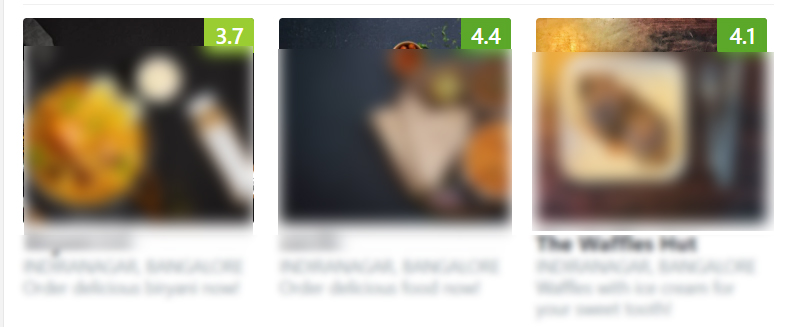
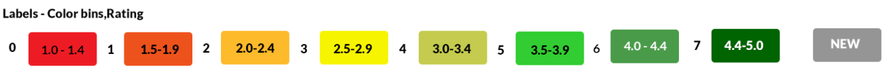
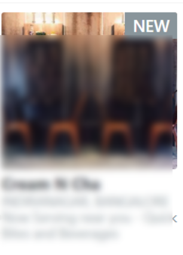
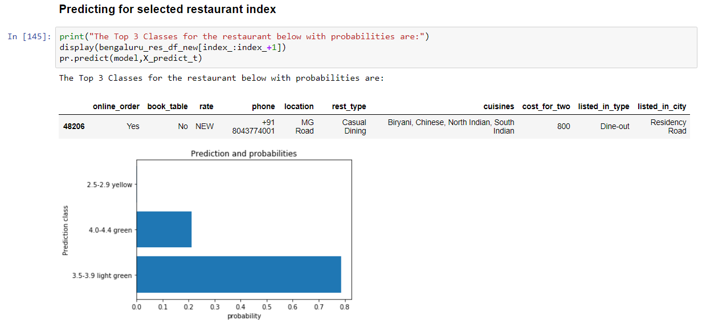

# Capstone Project Machine Learning
# Zomato Rating Bin Prediction For NEW Restaurants in Bengaluru
## Training Neural Network for Classification
## Udacity machine learning
#### 1. [Click here to View Report](https://github.com/shreyasdhuliya/Restaurant-Rating-prediction-onZomato/blob/master/zomato_bangalore_report2.ipynb) - Zomato_Bangalore_report2.ipynb

### Installation
1. **Python 3.6**  and libraries
 - [Numpy](http://www.numpy.org/)
 - [Matplotlib](http://matplotlib.org/)
 - [scikit-learn](http://scikit-learn.org/stable/)
 
 2. Anaconda 
 - Jupyther Notebook
 - [PyTorch](https://pytorch.org/get-started/locally/)
 
 ### Dataset Licence
 All copyrights for the data is owned by Zomato Media Pvt. Ltd..
 data is taken from [here](https://www.kaggle.com/himanshupoddar/zomato-bangalore-restaurants) and is only for educational purpose 
 
 ### Acknowledgement
 Thank you Himanshu Poddar for providing the data set in kaggle for others to use it for educational purpose
 https://www.kaggle.com/himanshupoddar/zomato-bangalore-restaurants
 
 ### introduction:
The overall rating on Zomato for a restaurant is not the average rating given by the customers. The rating is relative to other restaurants in the same city. Zomato has many algorithms to determine the final rating which can change with performance of other restaurants near by as well. The final ratings all the restaurants of a city is placed on a normal curve. Which makes them relative to each other. .(Zomato rating system) 
Some known factors are:
-	Frequency of ratings/reviews by customers
-	Rates/reviews of other nearest restaurants
Other factors are:
-	Location of the restaurant
-	Cuisines served  
-	Demography of the location
-	 Services of the restaurant – online service, cuisines
-	theme of the restaurant - Café, restaurant, pub, bar
-	category of the food served.
The final rating for the restaurant is in between 1 – 5 with interval of .1. The ratings can be like 1,1.1,1.2,…,4.8,4.9 or 5 for the overall rating. 

Figure 1: Three Restaurants and their Ratings on Zomato 
Src: zomato.com/bangalore/ 
The rating is color coded between 1-5 with interval .5 

Fig. 2. Color codes for ratings – color code selected based on nearest color.   
•	What is the Aim of the  Project?
For this project the ratings are classification problem with ratings falling in 8 different color bins as shown in figure 2. The 8 color bins are ratings with bin size of interval .5 between 1-5. 
The Aim of this project is to make a Deep Learning Neural Network model which predicts the color bin of the NEW restaurant it will fall in the future. There are 8 classes for prediction.

Figure 3: New Restaurant on Zomato 
Src: zomato.com/bangalore/ 
•	What are some predicating models?
A linear regression model can be used for predicting the rating. It is the simplest model which has been used to predict rating for wine quality and movie rating that assumes the problem is linearly defined.    

#### Motivation
Being an IT professional my self I have been dependent on food applications to search for meals when I chose not to cook. Prices are very important for me and to check if the food quality is good I find myself quickly scanning through the ratings based on which I think if the restaurants use good oil, prepares food properly, hygienic or not. Choosing 
from the same restaurants can be boring which pushes me to look for other restaurants for different taste and food. While choosing a new restaurant I look for rating before actually looking at the Menu.

 
 #### Files 
 `zomato_bangalore_report2.ipynb` - Jupyter notebook containing the systematic process for data exploration, pre-processing, training and predicting  
 
 `train.py` - Python code to train a neural network  
 `predict.py` - Python code to process and predict input features for prediction 
 `helper.py` - helper fucntions for pre-processing the data 
 `visuals.py` - functions to visualize the columns of the restaurnt dataset 
 `rates.json` - json file to convert label to category/class 
 `report.pdf` - Report explaining the project in detail 
 `images`- images used in notbook report
 
 #### Fnal Output
 
 Image shows 3 top rating bins with probability of predicting these class
 
 
 
 
